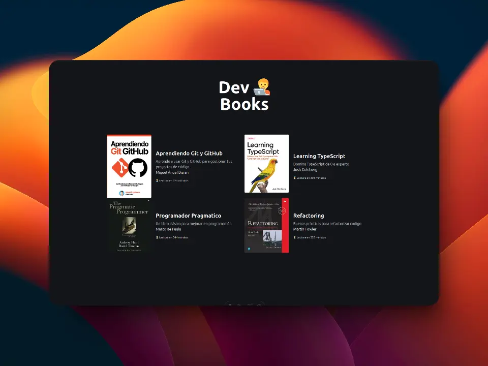

🏝️ Server Islands
====================

Página creada para fines didácticos y educativos y favorecer el entendimiento de las islas de servidores de Astro a través de una aplicación que comparte información de libros de programación.



🧰 Tool Kit
-----------

La siguiente lista recopila las tecnologías utilizadas en este proyecto.

- [astro](https://astro.build/), El framework web para sitios web impulsador por contenido.
- [tailwindcss](https://tailwindcss.com), La forma rápida de constuir sitios web sin nunca salir de su HTML; se utiliza a lo largo de todo el proyecto.
- [typescript](https://www.typescriptlang.org/), JavaScript con sintáxis para tipos.a
- [zod](https://zod.dev/), validador de esquemas de TypeScript con inferencia de tipos estáticos.

🚀 Project Structure
--------------------

Inside of your Astro project, you'll see the following folders and files:

```text
/
├── public/
│   └── favicon.svg
├── src/
│   ├── components/
│   │   └── Card.astro
│   ├── layouts/
│   │   └── Layout.astro
│   └── pages/
│       └── index.astro
└── package.json
```

Astro looks for `.astro` or `.md` files in the `src/pages/` directory. Each page is exposed as a route based on its file name.

There's nothing special about `src/components/`, but that's where we like to put any Astro/React/Vue/Svelte/Preact components.

Any static assets, like images, can be placed in the `public/` directory.

🧞 Comandos
-----------

Todos los comandos se ejecutan desde la raíz del proyecto.

| Command                    | Action                                           |
| :------------------------- | :----------------------------------------------- |
| `pnpm install`             | Installs dependencies                            |
| `pnpm run dev`             | Starts local dev server at `localhost:4321`      |
| `pnpm run build`           | Build your production site to `./dist/`          |
| `pnpm run preview`         | Preview your build locally, before deploying     |
| `pnpm run astro ...`       | Run CLI commands like `astro add`, `astro check` |
| `pnpm run astro -- --help` | Get help using the Astro CLI                     |
